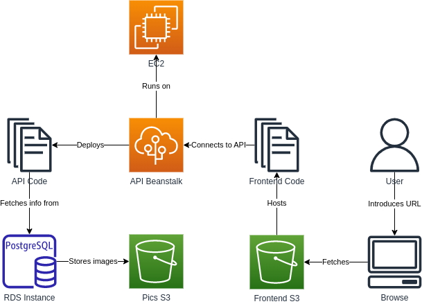

# Architecture

Here is a diagram of the architecture of the Full Stack Application:

The different components are:

- User: Introduces the URL in a Browser to see the application.
- Browser: Shows the webpage to the user, fetches it from the Frontend S3
- Frontend S3: Hosts the code of the frontend of the application
- Frontend Code: Source code of the frontend, it connects to the API hosted in the Elastic Beanstalk
- Elastic Beanstalk: Runs on top of an EC2 instance and it is where the API code is deployed.
- EC2 Instance: Compute node for the Elastic Beanstalk.
- API Code: Connects the database to the frontend.
- RDS Instance: Postgresql database to store the information about images and users for the application.
- Pics S3: Store the images of the application. The database fetches the images from here.