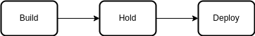

# Pipeline process

The Pipeline can be divided in three big steps:

- Build: In this step the pipeline does the following:
    - Spins up the environment to run the commands.
    - Prepares the environment variables that were setup in the Project.
    - Installs Node.js 14.15
    - Checkouts the code from the GitHub repo.
    - Installs all the dependencies of the frontend application.
    - Installs all the dependencies of the API.
    - Runs the Linting on the frontend application.
    - Builds the frontend application.
    - Builds the API.
- Hold: Waits for a manual approval to run the next step.
- Deploy: Deploy the application to the AWS environment. Does the following:
    - Spins up the environment to run the commands.
    - Prepares the environment variables that were setup in the Project.
    - Installs Node.js 14.15
    - Sets up Elastic Beanstalk CLI to deploy the API
    - Installs AWS CLI
    - Sets up Access Key for AWS
    - Checkouts the code from the GitHub repo.
    - Sets the environment variables in the Elastic Beanstalk.
    - Deploys the API on the Elastic Beanstalk.
    - Deploys the frontend application on a S3 Bucket.